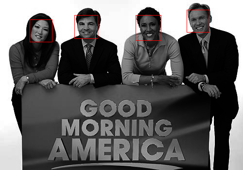

This is a Computational Vision project that uses the Viola Jones (https://en.wikipedia.org/wiki/Viola%E2%80%93Jones_object_detection_framework) framework to do face detection.

## Details
	HaarDetection.cpp contains the first 2 steps of the Viola Jones Algorithm.
	FaceDetection.cpp deals with the final part of Viola Jones.
	
	FaceDetection then takes 1 Parameter, an image.
	HaarDetection also takes 1 Parameter, an image.
	
	Example: ./FaceDetection gma.pgm
	Example: ./HaarDetection gma.pgm

## To Compile
	cmake . ( DOT included, Make sure CMake is installed on your system )
	make
	
## Before

## After

## Group Project by
	Andrew Miloslavsky
	Himanshu Tanwar
	Yuliya Emelyanova
	Manpreet Singh
	Jaber Janet
	
Credits to Rainer Lienhart for their trained face cascade classifier.
